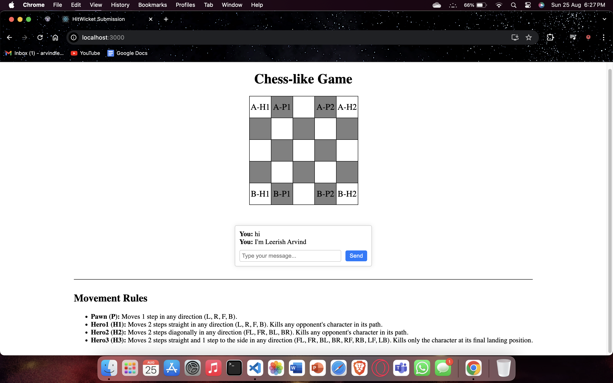
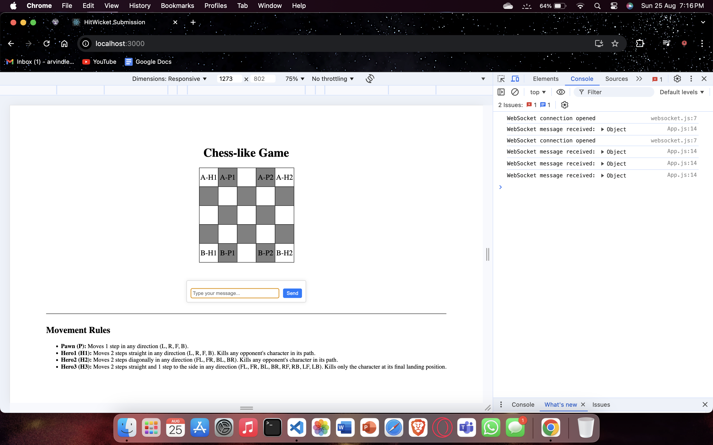
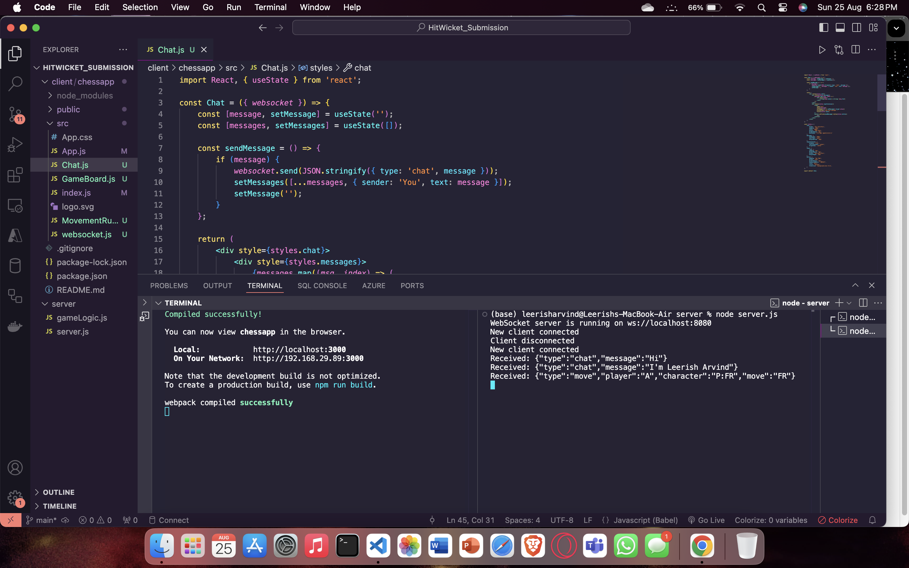

# Chess-like Turn-Based Strategy Game

## Introduction
This project is a turn-based, chess-like strategy game where two players control teams of characters on a 5x5 grid. Each player commands three types of characters: Pawn, Hero1, and Hero2, each with unique movement rules. The game is implemented with a server-client architecture, using WebSockets for real-time communication and a web-based interface built with React.Made by Leerish Arvind H G , 21BCE1867

## Features
- **Turn-based Gameplay:** Players take turns to move their characters.
- **Three Character Types:** Each character type has unique movement and attack patterns.
- **WebSocket Integration:** Real-time communication between the server and the client.

## Overview 
### Demo

### Console Output

### Terminal Logs

## Technology used 

### Front-End 
ReactJS 

### Back-End
NodeJs

## Installation
### Install Server Dependencies 
> `cd server`

> `npm install`

### Install Client Dependencies
>`cd ../client`
`npm install`

## Start Server

`cd ../server`

`node server.js`

## Start Client 
>`cd ../client`
`npm start`

